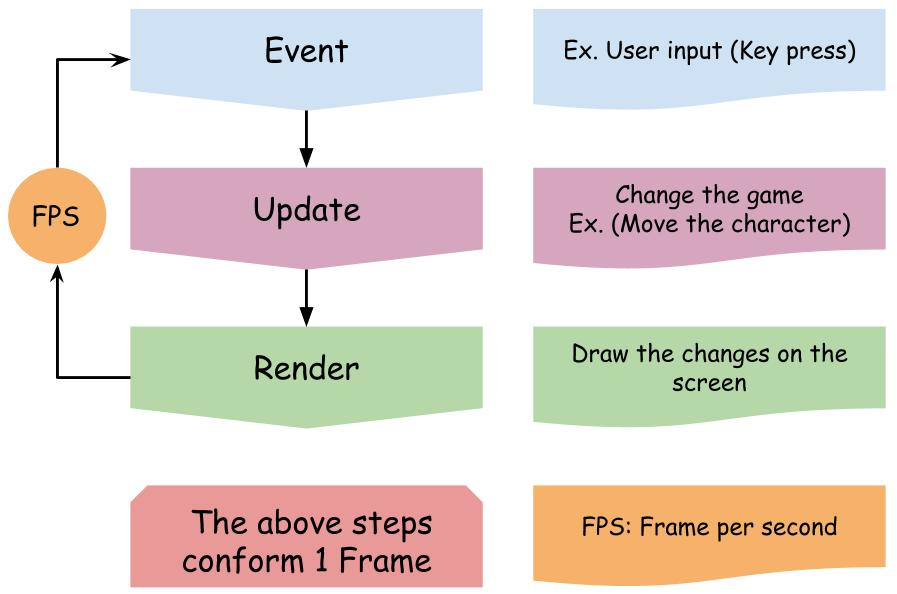

# Game flow

## Game flow for **1 FPS (frame per second)** consists of the following steps

### 1. Events

        key stroke and mouse presses (Ex. press w for forward or left click to shoot).

### 2. Update

        update the game after the event (Ex. move 'the hero' (sprite) after the event (w pressed)).

### 3. Render

        draw the current update on the screen.  

### 4. FPS Control

        controls the execute time.

# RGB colors

## RGB color consists of primary colors and secondary colors [Link to RGB Color Codes Chart](https://www.rapidtables.com/web/color/RGB_Color.html)

### Primary colors

        1. RED (255, 0, 0)
        2. Green (0, 255, 0)
        3. BLUE (0, 0, 255)

### Secondary colors

        1. YELLOW (255, 255, 0)
        2. SILVER (192, 192, 192)
        .....
