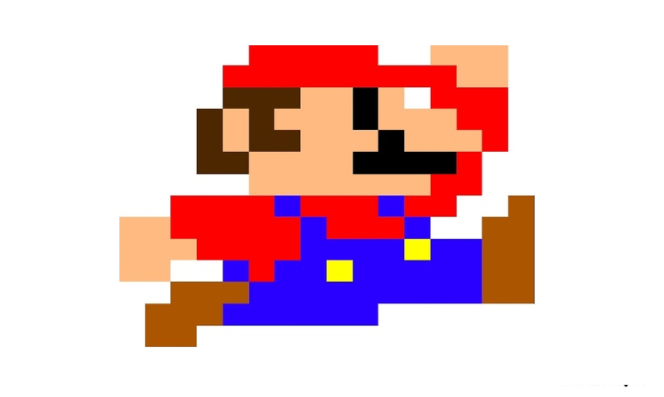
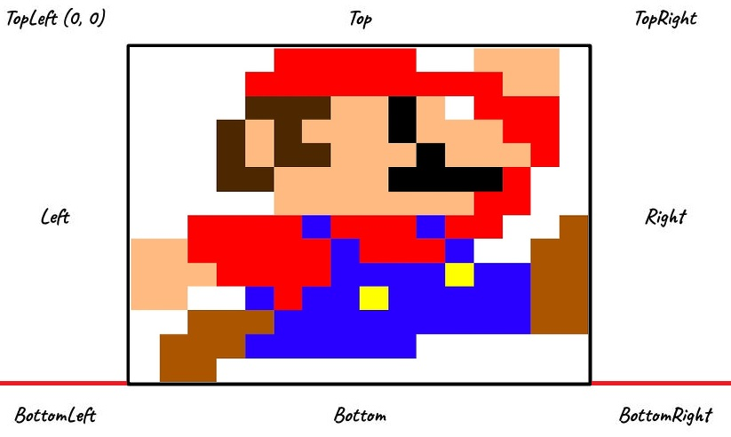

# Rect in pygame

Images (like the mario below) and shapes (pygame.Surfaces()) don't have "positions"

Using get_rect() method creates rect(rectangular) with the size of the image shape in the x, y coordinates (0, 0) (see the image below)

now the rect can be "interacted" with (move, collision etc.) by either the x, y coordinates or by using top, center, etc. (as shown in the image above)
